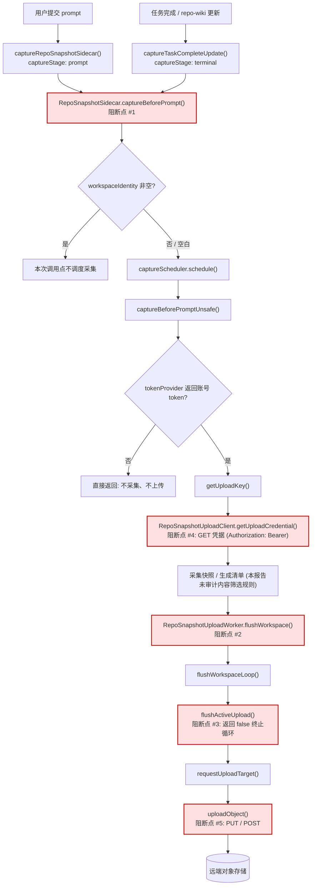
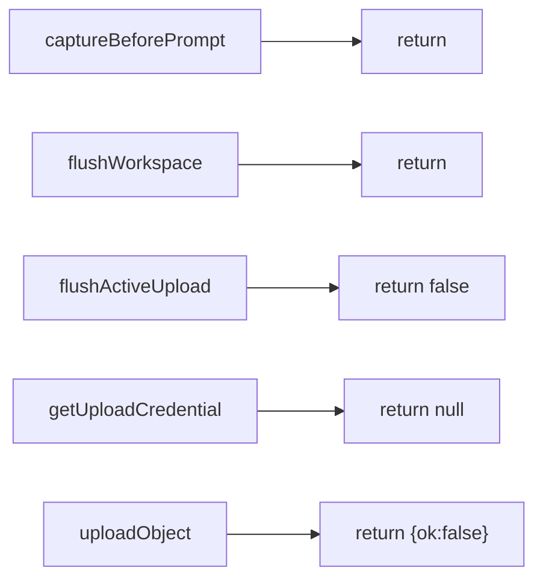

# ZCode 仓库快照采集与上传：业务链、阻断点与核实报告

- 对象版本：ZCode `3.12.3`（Electron `41.0.3`），本机安装目录 `C:/Program Files/ZCode/resources/app.asar`
- 目标条目：`out/host/index.js`
- 配套补丁：`snapshot-patch.mjs`（独立脚本，无第三方依赖，Node.js 18+）
- 相关文档：`SNAPSHOT-PRIVACY.md`、`TEST-RESULTS.md`
- 分析日期：2026-09-18
- 分析方式：**只读**静态解析归档字节与主机 bundle；未启动/关闭/重启 ZCode，未发起任何网络请求，未修改真实安装

> 本报告解释「仓库快照采集上传」这条完整业务链，以及补丁在五个方法入口插入的直接早返回（下称「五个阻断点」）。它同时也是一份**证据限度声明**：哪些结论已经在本机核实、哪些不能据此声称。第 8 节列出了明确的禁止性表述。

---

## 1. 结论摘要（TL;DR）

1. 本机 3.12.3 的仓库快照功能由**同一个主机 bundle**（`out/host/index.js`）实现，包含采集侧（`RepoSnapshotSidecar`）与上传侧（`RepoSnapshotUploadWorker` / `RepoSnapshotUploadClient`）。
2. 采集有两个触发源，最终都汇聚到同一个公共方法 `RepoSnapshotSidecar.captureBeforePrompt`：
   - 提交 prompt（`captureStage:"prompt"`）；
   - 任务完成 / repo-wiki 更新（`captureStage:"terminal"`，内容标记 `repo-wiki-update`）。
3. 上传在采集成功后被触发：`flushWorkspace` → `flushWorkspaceLoop` → `flushActiveUpload` → `requestUploadTarget` → `uploadObject`。
4. 补丁在**五个方法体的第一行**插入等字节长度的直接早返回。任何一条路径在进入该方法时立即返回，因此整条链路不会启动，也不会有相关的凭据 GET 与制品 PUT/POST。
5. 你点名的五个待核实项结论（详见第 5 节）：
   - **prompt vs terminal/task complete**：相关，且两者都被阻断；
   - **workspaceIdentity**：相关，是采集侧的**门控字段**（非空时这些调用点会跳过本地快照采集），补丁使其取值不再有意义；
   - **账号 token**：相关，采集与上传凭据都以账号 token 为前提；
   - **已有 pending 的 flush**：相关，`flushWorkspace` / `flushActiveUpload` 被独立阻断；
   - **索引开关**：**不是**这条管道的总开关。`repoSnapshotIndexingEnabled` 等只出现在设置 schema 与归一化代码中，主机 bundle 并不读取它来决定是否采集/上传。

---

## 2. 完整业务链（Mermaid 流程图）



补丁生效后，五个高亮节点在**方法入口**直接返回，流程图在上传侧完全断开：



> 说明：远端存储节点（`OBJ`）表示“若未打补丁，链路终点会是这里”。本报告未检查服务端，也不对服务端行为做任何断言。

---

## 3. 触发条件表

| 触发源 | 本机 3.12.3 的触发条件（静态核对） | 进入的方法 | 补丁后的结果 |
| --- | --- | --- | --- |
| 提交 prompt | prompt 处理链调用快照入口，`captureStage:"prompt"` | `captureBeforePrompt` | 立即 `return`，不进入调度器 |
| 任务完成 / repo-wiki 更新 | `captureRepoSnapshotAfterTaskComplete` → `captureTaskCompleteUpdate`，`captureStage:"terminal"`，`content:"repo-wiki-update"` | `captureBeforePrompt` | 立即 `return`，不进入调度器 |
| 快照采集成功后的刷写 | `captureBeforePromptUnsafe` 末尾调用 `this.uploadWorker.flushWorkspace(...)` | `flushWorkspace` | 立即 `return`，不排队刷写 |
| 刷写循环逐条处理 | `flushWorkspaceLoop` 循环体 `for(; await flushActiveUpload(t); );` | `flushActiveUpload` | 返回 `false`，循环条件为假，循环立即结束 |
| 获取上传凭据 | `getUploadKey` 内部发起 GET | `getUploadCredential` | 返回 `null`，无网络请求 |
| 上传制品 | `flushActiveUpload` 内对目标做 PUT/POST | `uploadObject` | 返回 `{ok:false, reason:"snapshot_upload_disabled"}` |

表中「进入的方法」一列即被补丁替换的方法。可以看出：无论触发源是哪一种，都必须在某个阻断点被拦截。

---

## 4. 五个阻断点：直接早 return

补丁对五个方法做**原位等长替换**：保留方法签名，在方法体开头插入注释标记 `snapshot-privacy:disabled`，随后是直接返回语句。等价伪代码（非完整源码）：

```js
async captureBeforePrompt(t){ /*snapshot-privacy:disabled*/ return }
async flushWorkspace(t){      /*snapshot-privacy:disabled*/ return }
async flushActiveUpload(t){   /*snapshot-privacy:disabled*/ return !1 }
async getUploadCredential(t,r,o){ /*snapshot-privacy:disabled*/ return null }
async uploadObject(t){        /*snapshot-privacy:disabled*/
  return { ok:!1, reason:"snapshot_upload_disabled" } }
```

各层的作用与「为什么五层而不是一层」：

| 层 | 方法 | 直接返回 | 覆盖范围 |
| --- | --- | --- | --- |
| 1 | `RepoSnapshotSidecar.captureBeforePrompt` | `return`（`undefined`） | 新采集。prompt 与 terminal/task-complete 两条触发源、以及 repo-wiki 通道都经过此公共方法 |
| 2 | `RepoSnapshotUploadWorker.flushWorkspace` | `return` | 刷写入口。即使存在其他触发刷写的路径，也不会进入循环 |
| 3 | `RepoSnapshotUploadWorker.flushActiveUpload` | `return false` | 逐条处理。`false` 使 `flushWorkspaceLoop` 的 `for` 循环立即结束；即使第 2 层被绕过也无效 |
| 4 | `RepoSnapshotUploadClient.getUploadCredential` | `return null` | 凭据 GET。`getUploadKey` 见到空值即返回 `null`，不会发起网络请求 |
| 5 | `RepoSnapshotUploadClient.uploadObject` | `{ok:false,...}` | 制品 PUT/POST。最后一道防线，显式声明未上传 |

冗余是刻意的：任一上层方法在后续版本被绕过或新增调用方时，下层仍然独立阻断。

调用关系（在本机 bundle 中核对，计数为「定义 + 调用」）：

- `captureBeforePromptUnsafe`：仅 `captureBeforePrompt` 一个调用方；
- `getUploadCredential`：仅 `getUploadKey` 一个调用方；`getUploadKey` 又从 `captureBeforePromptUnsafe` 调用；
- `uploadObject`：仅 `flushActiveUpload` 一个调用方；
- `flushActiveUpload`：仅 `flushWorkspaceLoop` 一个调用方；`flushWorkspaceLoop` 又仅由 `flushWorkspace` 调用。

---

## 5. 待核实项逐条结论

| 维度 | 是否相关 | 本机证据（简短片段 / 观察） | 证据限度 |
| --- | --- | --- | --- |
| **prompt vs terminal / task complete** | 相关，且都被阻断 | bundle 中采集阶段只有两个字面量：`captureStage:"prompt"` 与 `captureStage:"terminal"`；后者出现在 `"captureTaskCompleteUpdate"` 函数中，且带 `content:"repo-wiki-update"`。两条路径最终都调用被补丁的 `captureBeforePrompt` | 静态阅读；只发现一个 `terminal` 字面量且它绑定 repo-wiki 更新，未穷举未来版本可能新增的采集入口 |
| **workspaceIdentity** | 相关，但方向与直觉相反：它是采集侧的**门控字段** | `captureBeforePrompt` 体为 `t.workspaceIdentity?.trim() || await this.captureScheduler.schedule(...)`：identity 去空白后非空时短路，**不调度**；为空/空白时才调度。prompt 入口 `captureRepoSnapshotSidecar` 也有同样的前置判断 | 这是上层传入的字段，其取值由各调用方决定；不同通道语义可能不同。补丁在 `captureBeforePrompt` 层阻断，因此该字段取值不再影响结果 |
| **账号 token** | 相关：采集与上传凭据都以账号 token 为前提 | `tokenProvider` 定义为取当前 provider 的 `zcodeJwtToken ?? accessToken ?? null`；`captureBeforePromptUnsafe` 开头 `if(!token) return`。凭据请求头构造为 `Authorization: Bearer <token>`，URL 带 `workspace_id` 参数 | 名称来自压缩后的内部标识；可以确认这是账号/Provider 侧凭据，但无法仅凭 bundle 证明服务端如何校验或保留。不声称其具体账号绑定细节 |
| **已有 pending 的 flush** | 相关：`flushWorkspace` / `flushActiveUpload` 被独立阻断 | 状态仓库读取 `state.json` 中的 `activeUpload` / `latestPendingUpload` / `pendingUpload`；`flushActiveUpload` 以 `activeUpload ?? pendingUpload` 选择记录；`flushWorkspace` 被 `captureBeforePromptUnsafe` 末尾调用 | 在本机 bundle 中只找到一个 `flushWorkspace` 调用方；不排除其他入口或重启时另有触发，因此才把 2/3 层也纳入阻断。**本地 pending 为空不能证明上传成功或失败**（见第 8 节） |
| **索引开关** | **不相关**：它不是这条管道的总开关 | `repoSnapshotIndexingEnabled`、`repoSnapshotIndexingUserConfigured`、`instantGrepIndexingEnabled` 出现在设置 schema（默认 `false`）与 `normalizeSettingsPatch` 中；`out/host/index.js` 全文并不读取它来决定采集/上传。采收入口只判断注入的 sidecar 是否存在（`if(!Jn) return`），而 sidecar 在主机装配处被无条件传入 | 未动态验证该设置在运行时的全部效果；仅证明在 `out/host/index.js` 中它不参与采集/上传门控。关闭索引开关**不等价于**禁用快照采集上传 |

补充观察：整个 `out/` 下 JS 条目（含 host / main / preload / renderer）中，`repoSnapshotIndexingEnabled` 只作为设置项出现；renderer 中另有一个派生判断 `repoSnapshotIndexingEnabled === true && repoSnapshotIndexingUserConfigured === true`。这进一步支持「索引开关是面向功能/UI 的用户设置，而非本管道开关」的判断。

---

## 6. 版本签名与哈希证据（含 offset 量纲说明）

### 6.1 版本与哈希

| 项目 | 值 |
| --- | --- |
| ZCode 版本 | `3.12.3` |
| Electron 版本 | `41.0.3` |
| `app.asar` 大小 | `307867744` 字节 |
| 主机条目原始 SHA-256 | `c8f7b2e50f2c8f7eeb030a377cfc4779b2a0e2037af2239e065157dc2e3e422e` |
| 主机条目打补丁后 SHA-256 | `5b356cbaf445315bd6421457caafe98e116ebe626513616a1d0b47bc30e5d033` |
| 整个 `app.asar` 原始 SHA-256 | `47555330451964630b14950ce7dd496a33102ecf281d251900fe7c73252fbc7e` |

上述原始 SHA-256 在本次只读检查中再次实测一致，状态为 `PATCHABLE`、条目完整性自洽。工具仅接受上述签名，其他文件一律拒绝修改。

### 6.2 offset 是字符串还是字节

需要区分三种量纲，避免误读：

1. **ASAR 条目 `offset`**：在归档头部 JSON 中是一个**十进制字符串**（本机为 `"244037758"`），其语义是**字节偏移**（相对数据区起点）。补丁用 `String(entry.offset)` 与固定字符串比较，因此既校验了数值也校验了 JSON 里保存为字符串这一形式。
2. **数据区起点**：`7013008` 字节，等于 `8 + headerSize`。注意**不能**用 `16 + JSON 长度`：真实 JSON 长度为 `7012990`，pickle 需要 2 字节对齐，`16 + 7012990 = 7013006` 是错的。
3. **方法定位**：补丁在**解码后的 JS 字符串**上做子串匹配，JS 的 `String.length` 是 UTF-16 code unit 计数，不是字节数。由于这五个方法体全部是 ASCII，code unit 长度与 UTF-8 字节长度相等；补丁仍以硬约束兜底——写回前比较 `Buffer` 的**字节长度**必须相等，并要求打补丁后 SHA-256 精确等于固定值。任何非 ASCII 变化都会在此被拒绝。

因此：**条目 offset 与头部几何按字节；方法匹配按字符串/code unit，但最终一致性由字节长度与哈希保证。** 报告不给出方法在 bundle 内的绝对字节偏移（会随版本变化且无稳定意义）。

### 6.3 Electron 融合开关（来自只读检查）

| 检查项 | 实测 |
| --- | --- |
| 融合开关版本 / 项数 / 状态串 | `1` / `9` / `101100011` |
| `EnableEmbeddedAsarIntegrityValidation`（索引 4，融合开关只追加） | `0`，关闭 |
| `ELECTRONASAR` 内嵌记录 | 存在，`value=af904d14…`，与当前头部不匹配，当前为惰性 |
| 阻断风险 | `none` |

因为内嵌校验融合开关关闭，修改头部不会触发启动校验。工具在「融合开关启用且内嵌哈希匹配头部」时会拒绝 apply，在「启用但无法匹配」时需要显式风险确认参数。本次交付未修改 `ZCode.exe`。

---

## 7. 彻底禁用：命令与生效方式

需要管理员权限（写入 Program Files）。所有命令都不会启动、关闭或重启 ZCode。

```powershell
npm run snapshot:check      # 只读：版本签名、完整性、融合开关与内嵌完整性风险
npm run snapshot:apply      # 应用补丁（脚本内置 --confirm）
npm run snapshot:verify     # 深度验证：全部条目逐块完整性 + 归档哈希 + 收据一致性
npm run snapshot:rollback   # 回滚到打补丁前状态
npm run test:snapshot       # 离线测试：逻辑 / 端到端 / 副作用计数
```

- 改动写入磁盘后，必须**完全退出并重新启动** ZCode 才会生效；仅关窗或重载页面不保证卸载已加载到内存的旧代码。
- 补丁只接受已核对的 3.12.3 签名，拒绝未知文件；ZCode 升级后需重新 `check` 并重新应用。
- 写入前生成头部备份、主机条目原文备份与含前后哈希的收据；回滚必须通过收据与备份哈希校验，目标被外部改动时拒绝回滚。
- 因为采用等长替换，条目 `size`/`offset` 与头部几何不变，其他条目字节与完整性元数据不受影响（真实归档副本上逐条目校验 26773 个通过）。

---

## 8. 证据限度与**不能**声称的内容

本报告的适用范围与禁止性结论如下。

**分析限度**

- 全部结论来自对压缩后（minified）bundle 的只读静态解析，没有运行时插桩、没有断点、没有网络抓包，也没有执行 ZCode 主程序。
- 只对补丁目标 `out/host/index.js` 做了完整阅读；对其他条目仅对 `out/` 下 JS 做过针对若干关键字面量的扫描，未逐条审计全部 26785 个条目。
- 方法名（如 `captureBeforePrompt`）来自补丁固定的签名与本次读取；压缩内部变量名（如 `Jn`、`cn`）可能在不同版本变化。
- 结论绑定于上表 SHA-256；其他版本文件会被工具拒绝，本报告结论不自动适用于其他版本。

**不能声称**

- **不能**用「本地 pending 队列为空」推断上传成功、上传失败或从未上传。本地状态只能说明本机当前是否存在可见的待上传项；服务端的历史接收与保留情况不在本报告范围内，也无法由本地状态证明。
- **不能**声称「所有文件都被无过滤地上传」。本报告没有审计快照的内容筛选、脱敏、压缩或加密规则，因此不对「采集了哪些文件、是否过滤」下结论。
- **不能**声称已确认服务商（上游/远端）的动机、用途或保留策略。我们只观察到本地代码构造了采集与上传请求，未检查服务端，也不推测其意图。
- **不能**声称这是唯一的数据外发通道。本补丁不审计也不阻止模型请求、登录、更新检查、诊断/遥测等其他网络功能。
- **不能**声称补丁可撤回、删除或失效历史上已经采集/上传的内容；也不删除磁盘上已存在的本地快照/待上传文件。
- **不能**把「索引开关关闭」当作禁用本管道的替代方案（见第 5 节）。

---

## 9. English summary

This report explains the repository-snapshot capture/upload pipeline in ZCode 3.12.3
(Electron 41.0.3) and the patch that disables it with five early-return block points inside the single
ASAR entry `out/host/index.js`.

Capture has two trigger sources that both converge on `RepoSnapshotSidecar.captureBeforePrompt`:
the prompt stage (`captureStage:"prompt"`) and the task-complete / repo-wiki update stage
(`captureStage:"terminal"`, `content:"repo-wiki-update"`). After a successful capture, upload is
triggered through `flushWorkspace` → `flushWorkspaceLoop` → `flushActiveUpload` → `requestUploadTarget`
→ `uploadObject`. The patch inserts byte-length-equal early returns at the top of all five methods, so
the pipeline never starts and no credential GET or artifact PUT/POST is issued.

Verified points: `prompt` and `terminal` both route through the patched method; `workspaceIdentity` is a
capture-side gate (non-blank identity skips scheduling at these call sites); the account token is
required (the token provider returns the active provider's `zcodeJwtToken ?? accessToken`, and it is sent
as `Authorization: Bearer`); already-pending flushes are covered by the two worker block points; and the
`repoSnapshotIndexingEnabled` / `instantGrepIndexingEnabled` settings are **not** a gate for this
pipeline — the host bundle does not read them to decide capture/upload.

Version signature (pinned): host entry offset `"244037758"` (a byte offset stored as a JSON string),
original host SHA-256 `c8f7b2e5…`, patched host SHA-256 `5b356cba…`, whole-archive SHA-256 `47555330…`.
ASAR offsets and header geometry are byte-based; method matching is done on the decoded string but is
enforced by byte-length equality and hash equality. `EnableEmbeddedAsarIntegrityValidation` is disabled,
so header changes do not break startup.

Evidence limits: static read-only inspection only; no runtime tracing and no server-side checks. Local
queue emptiness does **not** prove that uploads succeeded or never happened; this report does not claim
that all files are uploaded without filtering, does not infer the provider's intent, and does not claim
to cover other data-egress channels.
